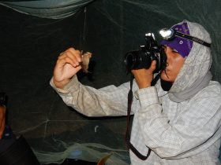
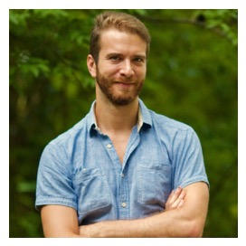

### Section 1: Acquiring and cleaning occurrence data from online databases

**Jonathan Spoelhof**, Ph.D. Candidate and Research Assistant

*Department of Biology and Florida Museum of Natural History*

 His research involves the use of big data to explore the relationship between polyploidy and niche adaptation in plants on a global scale. His project involves testing common assumptions about polyploidy in plants while generating new hypotheses and resources for future research.”

  
  

### Section 2: Climate data resources and how to extract usable estimates from past climate

**Laura Brenskelle** , Ph.D. Student and Research Assistant

*Department of Biology and Florida Museum of Natural History*

 “She is interested in integrating zooarchaeological data and paleoclimate reconstructions from the Maya Lowland areas of Belize, Guatemala, Honduras, and Mexico. Using data and spatiotemporal modeling tools, she investigates how the local and regional biota were affected by direct human exploitation, habitat modification, short-term climate changes such as droughts, and shifts of cultural complexity through time. Her research aims to improve our understanding of the complex interplay between humans, climate, and biodiversity.”

  

### Section 3: Raster images and estimation of forest cover in R

**Farah Carrasco Rueda**, Ph.D. Candidate in Interdisciplinary Ecology

*School of Natural Resources and Environment*

 Her research focuses on investigating large-scale factors involved in the mechanism behind  observed patterns of bat diversity. Her study area is Madre de Dios, Peru. She is also interested in developing new automated ways to analyze acoustic data, and preparing educational material  to rural communities.

  

### Section 4: Crown segmentation  and species identification with LiDAR and Hiperspectral data

**Sergio Marconi**, Ph.D. Student in Interdisciplinary Ecology

*School of Natural Resources and Environment*

 His research focuses on predicting changes in forest structure and functionality in a rapidly changing world. He is interested in investigating the ecological processes which determine patterns of plant functional traits within and across  forests in  U.S. He will use a combination of machine learning and process based models, applied to big data in Ecology.
