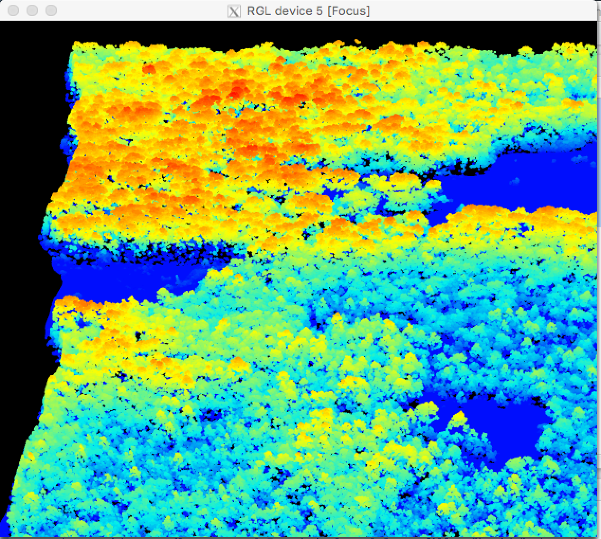
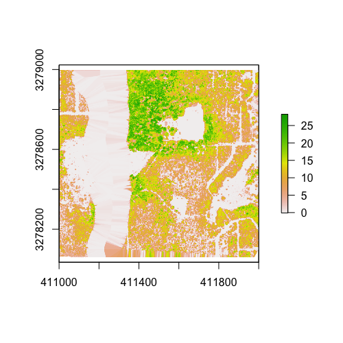

## Tree based species identification and biodiversity estimation using NEON AOP data

In this module we will see how to use LiDAR and hiperspectral data to identify tree species out of a scenery

### you will need:
1. intermediate knowledge of R
2. the lidR package

#### INDEX:
- Visualize LiDAR data
- Perform crown delineation
- Use SVM to perform classification
- Calculate biodiversity

### Visualize LiDAR data

First of all, we will need a LiDAR file, download it from https://blablabla.io

Brief description of the site and file

```{r}
library(lidR)
library(raster)
pt <-  "./inputs/LiDAR/"
f <- list.files(pt, pattern = ".laz")[1]
las = readLAS(paste(pt, f, sep=""))
```
# normalization

```{r}
lasnormalize(las, method = "knnidw", k = 10L)
```

Let's see what we have just imported in our environment
To plot the point cloud data we will be serving of an external software: Xquartz

```{r}
plot(las, color="Intensity", colorPalette = terrain.colors(50), trim=0.95)
```




You can also overimpose an rgb raster on top of it
```{r}
image_rgb   = stack(paste(pt, list.files(pt, pattern = "image.tif")[1], sep="/"))
#plotRGB(image_rgb, r=2, g=1, b=3)
# Get each channel in a RasterLayer
ch1 = image_rgb@layers[[1]]
ch2 = image_rgb@layers[[2]]
ch3 = image_rgb@layers[[3]]

# Attribute the channels in fields R,G and B
lasclassify(las, ch1, "R")
lasclassify(las, ch2, "G")
lasclassify(las, ch3, "B")

# build the color palette give the 3 channels
lascolor(las)
```


```{r}
#plot the scene
plot(las)
```

# Create a raster of heights
```{r}
    chm = grid_canopy(las, res = 0.5, subcircle = 0.2, na.fill = "knnidw", k = 4)
    chm = as.raster(chm)
```

Unfortunately, LiDAR point cloud data may be noisy. This means we would be willing to blur the image a little to avoid the crown delineation method to see artifact crowns
```{r}
plot(chm)
```


```{r}
kernel = matrix(1,3,3)
chm = raster::focal(chm, w = kernel, fun = mean)
chm = raster::focal(chm, w = kernel, fun = mean)
```

```{r}
plot(chm)
```


Now, let's try to apply a crown delineation algorithm (Silva et al., 2016). First of all we will need to look for the highest points, which will represent the top of our trees. Let's look at what are the parameters involved:

```{r}
?tree_detection
ttops = tree_detection(chm, 5, 2)
```

5 and 2 seem a reasonable way to go, for this case. At this point we can predict our crowns' shape!

```{r}
crowns <-lastrees_silva(las, chm, ttops, max_cr_factor = 0.6, exclusion = 0.3, extra = T)
#find a way to polygonize which doesn't involve the use of python
```

```{r}
plot(crowns)
```

